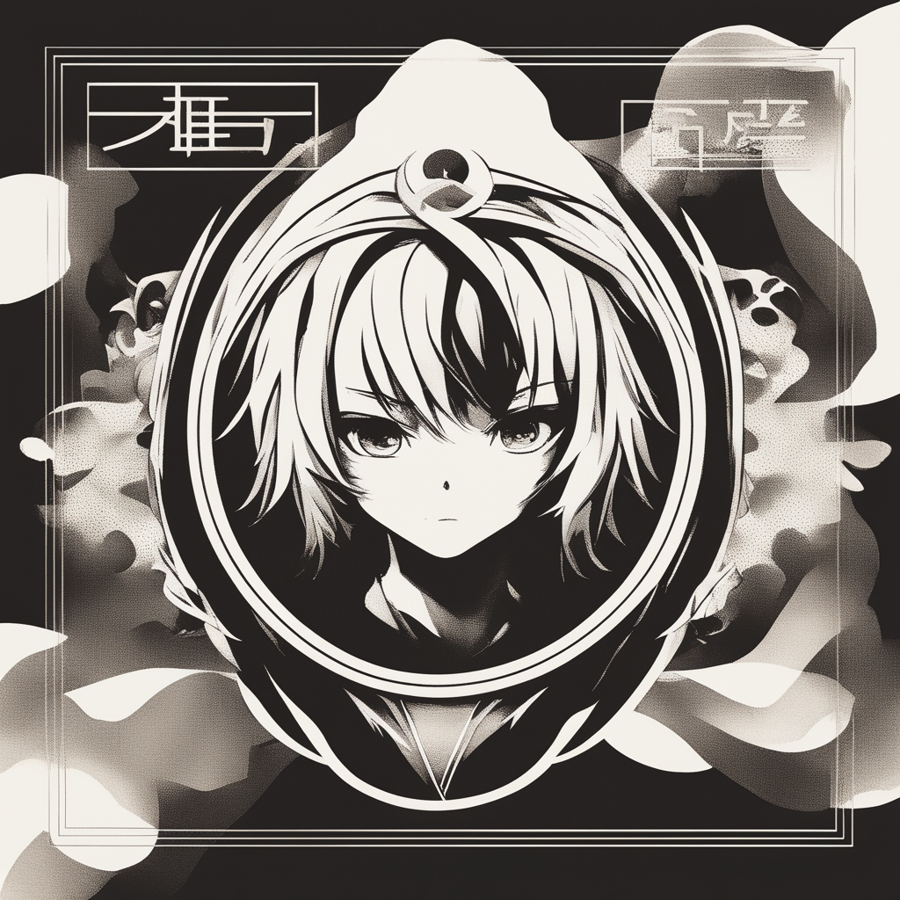

[![Contributors][contributors-shield]][contributors-url]
[![Stargazers][stars-shield]][stars-url]
[![Issues][issues-shield]][issues-url]

<!-- PROJECT LOGO -->
 

  

<h3 align="center">Anime Collection</h3>

  

    Open web project for anime collections and quizzes.
     
    <a href="https://github.com/RDMaven/anime-collection"><strong>Explore the docs »</strong></a>
  

<!-- TABLE OF CONTENTS -->

  
Table of Contents

  <ol>
    <li>
      <a href="#about-the-project">About The Project</a>
      <ul>
        <li><a href="#built-with">Built With</a></li>
      </ul>
    </li>
    <li><a href="#contributing">Contributing</a></li>
    <li><a href="#contact">Contact</a></li>
  </ol>

<!-- ABOUT THE PROJECT -->
## About The Project

[![Product Name Screen Shot][product-screenshot]](https://example.com)

(<a href="#readme-top">back to top</a>)

## Construction plan

- Import (top) animes from https://www.anime-planet.com/anime/all?year=2010&include_types=6&page=2
  - Range : >= 2010; type: TV (regular anime series)
- Import characters from https://www.anime-planet.com/
- Create database following a similar idea : [source-sql-organization](https://www.w3resource.com/sql-exercises/movie-database-exercise/sql-exercise-movie-database-42.php)

### Built With

* 

(<a href="#readme-top">back to top</a>)

<!-- CONTRIBUTING -->
## Contributing

Contributions are what make the open source community such an amazing place to learn, inspire, and create. Any contributions you make are **greatly appreciated**.

If you have a suggestion that would make this better, please fork the repo and create a pull request. You can also simply open an issue with the tag "enhancement".

1. Fork the Project
2. Create your Feature Branch (`git checkout -b feature/AmazingFeature`)
3. Commit your Changes (`git commit -m 'Add some AmazingFeature'`)
4. Push to the Branch (`git push origin feature/AmazingFeature`)
5. Open a Pull Request

(<a href="#readme-top">back to top</a>)

### Top contributors:

<!-- CONTACT -->
## Contact

RDMaven - maxjosephantoine@gmail.com

Project Link: [https://github.com/RDMaven/anime-collection](https://github.com/RDMaven/anime-collection)

(<a href="#readme-top">back to top</a>)

<!-- MARKDOWN LINKS & IMAGES -->
[contributors-shield]: https://img.shields.io/github/contributors/RDMaven/anime-collection.svg?style=for-the-badge
[contributors-url]: https://github.com/RDMaven/anime-collection/graphs/contributors
[forks-shield]: https://img.shields.io/github/forks/RDMaven/anime-collection.svg?style=for-the-badge
[forks-url]: https://github.com/RDMaven/anime-collection/network/members
[stars-shield]: https://img.shields.io/github/stars/RDMaven/anime-collection.svg?style=for-the-badge
[stars-url]: https://github.com/RDMaven/anime-collection/stargazers
[issues-shield]: https://img.shields.io/github/issues/RDMaven/anime-collection.svg?style=for-the-badge
[issues-url]: https://github.com/RDMaven/anime-collection/issues
[license-shield]: https://img.shields.io/github/license/RDMaven/anime-collection.svg?style=for-the-badge
[license-url]: https://github.com/RDMaven/anime-collection/blob/master/LICENSE.txt
[linkedin-shield]: https://img.shields.io/badge/-LinkedIn-black.svg?style=for-the-badge&logo=linkedin&colorB=555
[linkedin-url]: https://www.linkedin.com/in/max-joseph-antoine-765450134/
[product-screenshot]: images/screenshot.png
